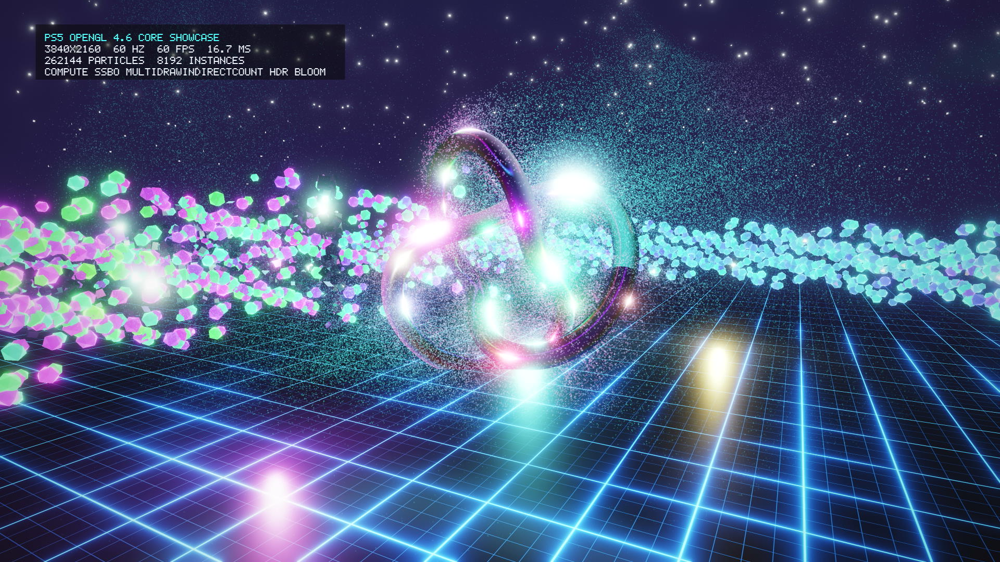

<h1 align="center">PS5 OpenGL</h1>

<p align="center">
  <strong>OpenGL 4.6 Core and GLSL 4.60 for PlayStation 5 homebrew</strong><br>
  A native graphics stack built on Mesa/Gallium: runtime shader compilation,
  fullscreen EGL at 1080p, 1440p or 4K, a relocatable static SDK and an SDL2 bridge.
</p>

<p align="center">
  <a href="https://github.com/blackbearreloaded/ps5-opengl/releases/latest"></a>
  
  
  
  
  <a href="LICENSE"></a>
</p>

[](https://i.imgur.com/4KKg2xn.mp4)

*Click the image to watch the demo.*

> [!IMPORTANT]
> PS5 OpenGL is experimental and **not Khronos-certified**. It runs in an already
> configured native homebrew environment; it does not provide console enablement
> or guarantee that desktop applications run unchanged.

## Highlights

- **OpenGL 4.6 Core / GLSL 4.60:** all 657 core commands are exported by the static SDK,
  with Mesa state tracking and runtime shader compilation to native GPU code.
- **One SDK for every display:** choose 1080p, 1440p or 4K at 60 or 120 Hz at runtime;
  the PS5 scales the picture to whatever the TV accepts.
- **Modern GPU features:** compute shaders, SSBOs, image load/store, indirect and
  indirect-count multi-draw with `gl_DrawID`, direct state access, float render
  targets, 16x anisotropic filtering, timer queries and tessellation/geometry stages.
- **Accelerated paths:** GPU draws with batching, and GPU clears, blits, transfers and
  mip/layer paths where eligible; remaining cases fall back to the CPU.
- **Drop-in integration:** Make, pkg-config and CMake packages, an SDL2 bridge, and
  examples from a minimal triangle to Dear ImGui, NanoVG, Sokol and a 4K showcase.

## Quick start

Download the latest SDK from [Releases](https://github.com/blackbearreloaded/ps5-opengl/releases/latest),
verify it with its `.sha256` file and point your build at its `sdk/` directory
(see [using the SDK](docs/consumer-build.md)). Then create a context as on any EGL platform:

```c
#include <EGL/egl.h>
#include <ps5_opengl_display_modes.h>   /* SDK 0.5.0 and later */

EGLDisplay display = eglGetDisplay(EGL_DEFAULT_DISPLAY);
eglSetDisplayModePS5(display, 3840, 2160);   /* optional: 1080p is the default */
eglSetDisplayRefreshPS5(display, 60);
eglInitialize(display, NULL, NULL);
eglBindAPI(EGL_OPENGL_API);
/* eglChooseConfig, then eglCreateWindowSurface(display, config, 0, NULL)
   and an OpenGL 4.6 Core context, as usual. */
```

Package the result as a native title folder (the
[native app boilerplate](https://github.com/blackbearreloaded/ps5-native-app-boilerplate)
does this) and launch it as a registered title; do not send it to an ELF loader.

## Display modes

| Mode | Size | Refresh | |
| --- | --- | --- | --- |
| 1080p (Full HD) | 1920×1080 | 60 / 120 Hz | Startup default |
| 1440p (QHD, "2K") | 2560×1440 | 60 / 120 Hz | |
| 2160p (4K UHD) | 3840×2160 | 60 / 120 Hz | |

Modes are chosen before EGL starts and changed by restarting EGL; a display without
120 Hz keeps presenting at 60 Hz. See [Display modes](docs/display-modes.md).

## Examples

| Example | Demonstrates |
| --- | --- |
| [OpenGL 4.6 showcase](examples/core46-showcase/README.md) | 4K at 120 FPS: 262k compute particles, GPU culling into `glMultiDrawElementsIndirectCount`, HDR bloom |
| [OpenGL 4.6 compute cubes](examples/core46-compute-cubes/README.md) | Compute-driven SSBO animation and indirect instanced drawing |
| [Triangle](examples/core33-triangle/README.md) | Minimal EGL/OpenGL application |
| [Dear ImGui](examples/core33-imgui/README.md) | Widgets, fonts, animated shapes and controller navigation |
| [NanoVG](examples/core33-nanovg/README.md) | Upstream GL3 vector renderer |
| [Sokol](examples/core33-sokol/README.md) and [Sokol cube](examples/core33-sokol-cube/README.md) | Existing renderer integration, depth and culling |
| [Textured cubes benchmark](examples/core33-cubes/README.md) | Ordinary versus instanced drawing |

Each SDK release also attaches the showcase as a ready-to-install demo app
(`ps5-opengl-showcase-<version>-PPSA99005.zip`). Each example is packaged as the
native test title `PPSA99005`:

```sh
make source-fetch
make sdk-gl46          # or set PS5_OPENGL_PREFIX to a downloaded SDK's sdk/ directory
make showcase          # imgui-demo, nanovg, sokol, sokol-cube, gl46-demo, ...
```

Deploy `build/native-app/PPSA99005/dist/PPSA99005` to `/data/homebrew/PPSA99005`.

`make demo` builds the demo app on its own: it builds the SDK if needed, fetches the
pinned native-app boilerplate below `build/`, builds the showcase and writes
`build/demo/ps5-opengl-showcase-<DEMO_VERSION>-PPSA99005.zip` with its checksum.
It only builds; it never deploys or runs anything.

## Build from source

`make sdk` builds the shader compiler, Mesa and the installed OpenGL 4.6 SDK into
`build/sdk/ps5-opengl-gl46`, running its compiler tests and capability audit; `make test`
runs the host test suite. The build uses every CPU core and ccache when installed.
See [Building](docs/building.md) for prerequisites and build options.

## Performance

| Workload at 4K | Completed frames/s |
| --- | ---: |
| OpenGL 4.6 showcase, SDK 0.5.0 (120 Hz display) | 119.9 |
| Dear ImGui window, SDK 0.2.0 | 119.88 |
| 128 textured cubes, ordinary draws, SDK 0.2.0 | 58.09 |
| 128 textured cubes, instanced draws, SDK 0.2.0 | 117.41 |

A full native app (ProsperoPuzzles) holds 60 FPS at 1080p, 1440p and 4K on SDK 0.5.0.
These are workload measurements, not general game FPS. See
[performance and methodology](docs/performance.md).

## Validation

The OpenGL 4.6 development inventory accounts for **19,714 Khronos CTS cases**:
15,233 pass, 4,480 reviewed `NotSupported` and one legal compatibility warning
([report](docs/gl46-development-validation.md)). The frozen OpenGL 3.3 campaign
accounts for 39,544 results: 37,404 pass and 2,140 reviewed `NotSupported`
([report](docs/validation.md)). Machine-readable evidence is checked by `make test`.

This is engineering validation, not Khronos certification; newer binaries carry
focused regressions rather than inheriting a full campaign. Hardware results cover
one firmware-6.02 console. See [supported boundaries](docs/limitations.md).

## Releases

| SDK | Highlights |
| --- | --- |
| [0.6.0](https://github.com/blackbearreloaded/ps5-opengl/releases/tag/v0.6.0) | Queued compute: about 15-35 us of CPU per dispatch instead of 1.1 ms; showcase demo app |
| [0.5.0](https://github.com/blackbearreloaded/ps5-opengl/releases/tag/v0.5.0) | One SDK for every display: 1080p/1440p/4K at 60/120 Hz chosen at runtime |
| [0.4.1](https://github.com/blackbearreloaded/ps5-opengl/releases/tag/v0.4.1) | Presentation, native preparation and descriptor publication fixes |
| [0.3.0](https://github.com/blackbearreloaded/ps5-opengl/releases/tag/v0.3.0) | First OpenGL 4.6 release ([scope](docs/release-0.3.0.md)) |
| [0.2.0](docs/release-g62.md) | Historical OpenGL 3.3 release |

## Documentation

- [Documentation index](docs/README.md)
- [Using the SDK](docs/consumer-build.md), [display modes](docs/display-modes.md) and [SDL2 integration](integration/SDL2/README.md)
- [Building](docs/building.md), [testing](docs/testing.md) and [CI releases](docs/ci-releases.md)
- [Architecture](docs/architecture.md), [lifecycle](docs/lifecycle-reopen.md) and [limitations](docs/limitations.md)
- [Performance](docs/performance.md) and [validation](docs/validation.md)
- [Contributing](CONTRIBUTING.md) and [third-party notices](THIRD_PARTY_NOTICES.md)

## Project references

| Project | Role |
| --- | --- |
| [Mesa](https://www.mesa3d.org/) | OpenGL, Gallium, GLSL/NIR, ACO/RADV and AMD layout infrastructure |
| [OpenGNM PSBC](https://github.com/PS4-OpenGNM/opengnm-psbc) / [OpenGNM](https://github.com/PS4-OpenGNM/opengnm) | Shader compiler foundation and reference declarations |
| [PS5 Payload SDK](https://github.com/ps5-payload-dev/sdk) | Public homebrew toolchain and imports |
| [Native app boilerplate](https://github.com/blackbearreloaded/ps5-native-app-boilerplate) | Native app assembly and folder packaging |
| [PS5 GPU research](https://github.com/blackbearreloaded/ps5-gpu-research) | Shader toolchain, memory, submission and presentation findings |
| [Khronos VK-GL-CTS](https://github.com/KhronosGroup/VK-GL-CTS) | Pinned OpenGL test inventory and runner |
| [SDL2](https://github.com/libsdl-org/SDL), [Dear ImGui](https://github.com/ocornut/imgui), [NanoVG](https://github.com/memononen/nanovg), [Sokol](https://github.com/floooh/sokol) | Integration and renderer examples |

## Maintainer and license

Maintained by [BlackBearReloaded](https://github.com/blackbearreloaded). Upstream
projects retain their authorship and licenses. Project-owned code is
[GPL-3.0-or-later](LICENSE); see [third-party notices](THIRD_PARTY_NOTICES.md) and
[LICENSES](LICENSES).

No vendor SDK, firmware modules, device keys, proprietary shader packages,
console-enablement payloads or raw device logs are distributed here. This
independent project is not affiliated with Sony or The Khronos Group.
